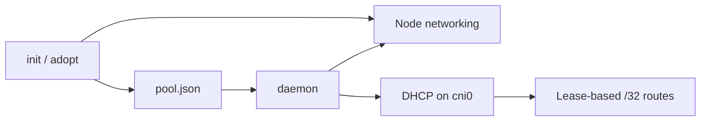

# cocoon-net

VPC-native networking for [Cocoon](https://github.com/cocoonstack/cocoon) VM
nodes. Provisions cloud networking resources and runs an embedded DHCP
server so VMs obtain VPC-routable IPs directly -- no overlay network, no
iptables DNAT, no external DHCP server dependency.

**Documentation: [cocoonstack.github.io/cocoon-net](https://cocoonstack.github.io/cocoon-net/)** (source in [`docs/`](docs/)).

## Architecture



**Two-phase operation**: `cocoon-net init` does one-time cloud provisioning
and state persistence, while `adopt` registers a node whose cloud side was
provisioned by hand (GKE: no cloud API call; Volcengine: one read of the
ENI secondary IPs, the only addresses the VPC routes to the node);
`cocoon-net daemon` is the
long-running service that sets up node networking, serves DHCP, and manages
routes.
Full details in [Architecture](docs/architecture.md).

### Supported platforms

| Platform | Mechanism | Max IPs/node |
|---|---|---|
| GKE | VPC alias IP ranges (`gcloud`) | 253 |
| Volcengine | Dedicated subnet + secondary ENI IPs (`ve` CLI) | 140 (7 ENIs x 20) |

## Quick start

```bash
sudo install -m 0755 cocoon-net /usr/local/bin/
sudo cocoon-net init --platform gke --node-name cocoon-pool --subnet 172.20.100.0/24 --pool-size 140
sudo cocoon-net daemon
```

Full steps in [Installation](docs/installation.md).

## Related projects

| Project | Role |
|---|---|
| [cocoon](https://github.com/cocoonstack/cocoon) | MicroVM engine (Cloud Hypervisor + Firecracker) |
| [cocoon-common](https://github.com/cocoonstack/cocoon-common) | Shared metadata, Kubernetes, and logging helpers |
| [cocoon-operator](https://github.com/cocoonstack/cocoon-operator) | CocoonSet and Hibernation CRDs |
| [cocoon-webhook](https://github.com/cocoonstack/cocoon-webhook) | Admission webhook for cocoon pod ownership, scale-down protection, and CocoonSet/CocoonHibernation validation |
| [vk-cocoon](https://github.com/cocoonstack/vk-cocoon) | Virtual kubelet provider |

## Development

```bash
make build      # build binary
make test       # run tests with coverage
make lint       # golangci-lint (linux + darwin)
make fmt        # gofumpt + goimports
```

## License

[MIT](LICENSE)
